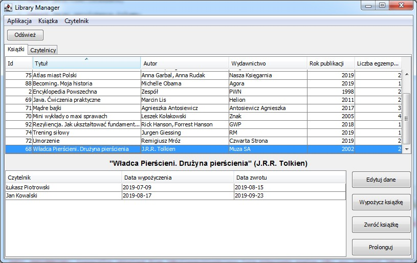
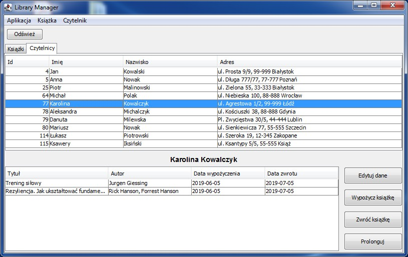
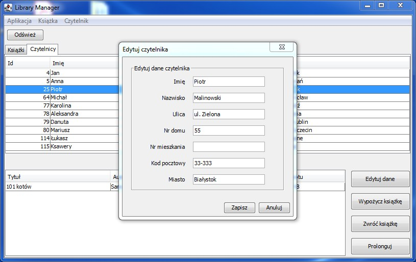

# library-manager
A simple GUI application to manage a library database

Technologies used:
* Java 8
* Hibernate
* H2 database (embedded)
* Maven

Current functionality:
* Display the list of books and readers
* Borrow and return books
* Display the list of books borrowed by a given reader and the list of readers who borrowed a given book
* Add and delete readers and books, edit book and reader data

How I plan to develop the project:
* Add transaction history for books and readers
* Add unit tests

Screenshots:

